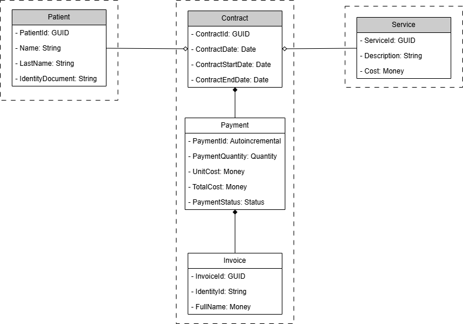

# CONTRACT SERVICE - MICROSERVICE

## Reference Documentation

### Domain

Three aggregates were defined and organized into packages.

* **Contract** - includes 3 entities Contract, Payment, and Invoice.
* **Patient** - includes only 1 entity Patient.
* **Service** - includes only 1 entity Service.

Three Value Objects were identified.

* **Money** - which controls and validates details of currency for Unit Cost, Total Cost, Price, etc.
* **Quantity** - which controls and validates details of quantity of services.
* **Status** - which controls values of Payment Status.

***Note***: According to a revision of documentation, Aggregates control operations and Units of Work are controlled by JPA in Java + Spring Boot by using Special Annotations.

***Note 2***: It is possible that Domain changes during the development of the rest of the layers.

### Application

TBD - Use cases

### Presentation

TBD - Controllers

### Infrastructure

TBD - JPA, Database